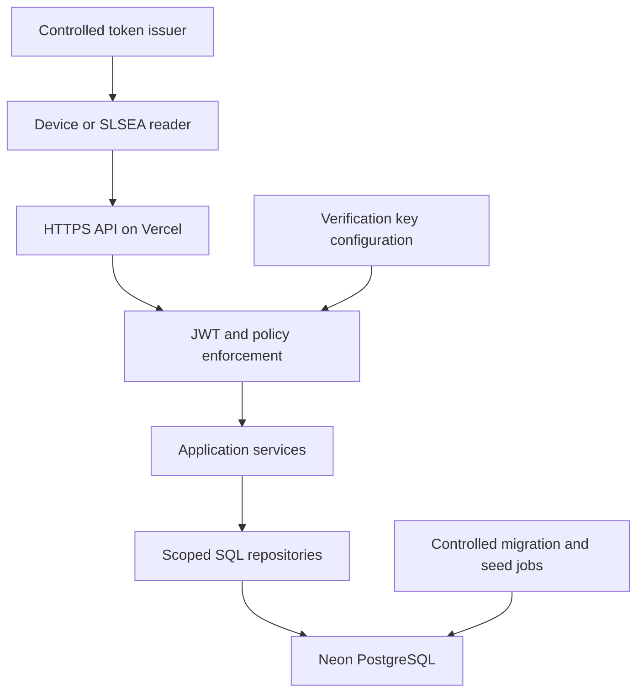
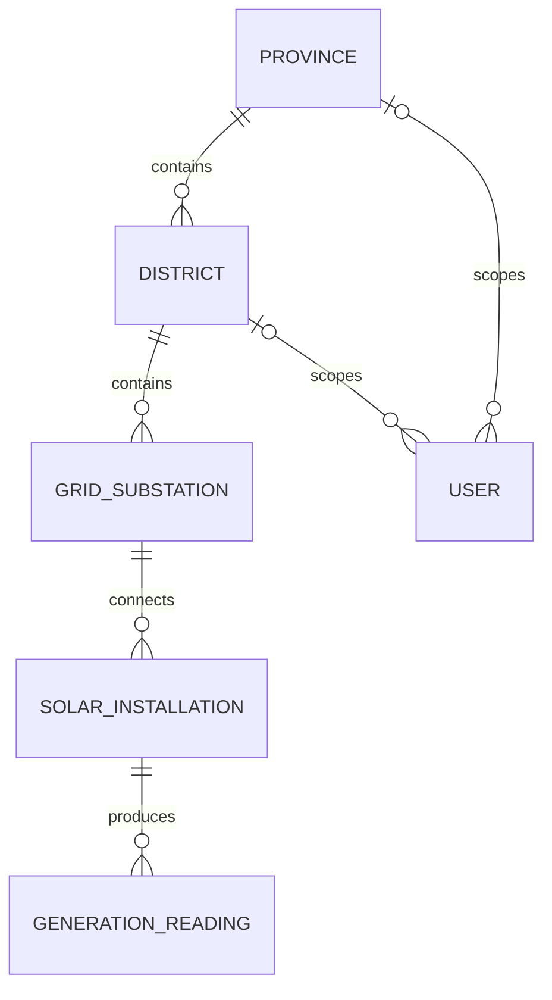

# Architecture: SLSEA Solar Generation API

**Status:** Implemented and deployed (release `d0b7130`, 2026-10-07). Sections 1-12 are the original proposal; §13 records what was accepted, implemented and verified.  
**Date:** 7 October 2026  
**Primary plan:** `PLAN.md`  
**Project state:** `PROJECT.md`  
**AI-use record:** `AI_LOG.md` (local)

## 1. Context

One backend REST API receives timestamped solar-generation data from installation devices and serves SLSEA analysts at national, provincial or district scope. Vercel hosts the API and documentation; Neon PostgreSQL holds the durable data. No client/dashboard is required.

The coursework brief and marking rubric are authoritative for the assessed behavior. The WSO2 white paper provides the design standard. Source paths, discrepancies and implementation references are recorded in `PLAN.md` §§2 and 24.

## 2. Non-negotiable invariants

1. The domain is Province → District → GridSubstation → SolarInstallation → GenerationReading, plus User.
2. Meter/inverter identity is an installation attribute, not a separate Device entity.
3. GenerationReading is an append-only time series. No normal API mutates or deletes history.
4. An installation device writes only its own readings. SLSEA users are readers only.
5. Authorization applies before selecting/counting/aggregating data and before conditional responses.
6. Query filters can narrow authorized scope but cannot widen it.
7. Vercel execution is stateless; PostgreSQL owns durable state.
8. Report prose must be the student's own work. Proposed architecture is not evidence of an implemented feature.

## 3. Context and trust boundaries

The private signing key belongs to the controlled issuer, not the deployed API. Database credentials are server-side secrets. Public Swagger describes and exercises the API but carries no embedded bearer tokens. Network reachability does not imply unrestricted business access.

## 4. Conceptual entity model

| Entity | Ownership/cardinality | Key constraints |
|---|---|---|
| Province | Parent of many Districts | Unique geographic code |
| District | Exactly one Province; many GridSubstations | Valid province FK |
| GridSubstation | Exactly one District; many SolarInstallations | Valid district FK; unique code |
| SolarInstallation | Exactly one GridSubstation; many GenerationReadings | Unique meter ID, positive capacity |
| GenerationReading | Exactly one SolarInstallation | Unique site/timestamp, finite measurements, immutable history |
| User | National, one Province, or one District scope | Role/jurisdiction consistency; active flag |

Readings contain installation, observation timestamp, instantaneous kW, cumulative kWh and voltage V. Receipt timestamps are separate from observation timestamps. The operational last-known reading is derived from history by observation time; it is not a replacement for history.

Physical schema: `migrations/001_initial_schema.sql`; data dictionary in §13.1.

## 5. Components (implemented)

| Component | Responsibility | Files |
|---|---|---|
| Vercel entry + app factory | Entry must import express (Vercel detection); factory wires middleware order 401→406→403→400→404 | `src/app.ts`, `src/create-app.ts`, `src/deps.ts` (env config, pg pool + `attachDatabasePool`, NUMERIC/INT8/DATE parsers) |
| JWT + principals | ES256 verify/sign, claim schema; DB-backed principal (device/user/service), scope intersection | `src/auth/tokens.ts`, `src/auth/principal.ts`, `src/auth/middleware.ts` (`authenticate`, `requireReader`, `requireDeviceWriter`, `requireManager`, `requireReaderOrManager`) |
| HTTP helpers | Error catalogue + body (G §11), Accept negotiation, ETag/304/IMS, pagination envelope, request id, logging, security headers, JSON body (415/400/413), 405 | `src/http/errors.ts`, `negotiate.ts`, `respond.ts`, `pagination.ts`, `middleware.ts`, `validate.ts` |
| Routes | One module per resource group; `resource()` registers methods + 405 | `src/routes/provinces.ts`, `districts.ts` (incl. summary), `substations.ts`, `installations.ts` (atom, overview, last-known, CRUD), `readings.ts` (history, regional, ingest, atom), `docs.ts`, `route.ts` |
| Repositories (scoped SQL) | Parameterised SQL; jurisdiction predicates via `geoConditions` before select/count/aggregate; snapshot reads | `src/repositories/*.ts` (`scope.ts`, `sql.ts`, `geography.ts`, `installation-admin.ts`, `summary.ts`, `overview.ts`, …), `src/db/snapshot.ts` |
| Services | Pure district-summary arithmetic + Asia/Colombo day bounds | `src/services/summary.ts` |
| Database | Schema, append-only trigger, migration runner, runtime role grants | `migrations/001_initial_schema.sql`, `src/db/migrate.ts`, `src/db/runtime-role.ts` |
| Seed | Deterministic generator, writer, verifier | `src/seed/geography.ts`, `generate.ts`, `seed.ts`, `verify.ts` |
| Contract | OpenAPI 3.1 source of truth (v1.0) | `openapi/openapi.yaml` (served at `/openapi.json`), Swagger shell in `src/routes/docs.ts` + `public/swagger-ui/` |
| Operational scripts | migrate, seed, verify, runtime role, token (keygen/issue/inspect/tamper), simulator, smoke, local DB, build (vendor refresh) | `scripts/*.ts` |
| Tests | Unit (pure/HTTP helpers/contract) and integration (embedded PG 18, API as `solar_api`) | `tests/unit/*`, `tests/integration/*` (`global-setup.ts`, `app.ts` harness) |

Do not couple service business rules to Express response objects. Do not allow a repository method to omit authorization context accidentally. Public health checks and controlled migration jobs use explicit, narrowly named exceptions rather than an unscoped default.

## 6. Principal policy

| Principal | Scope | Effective authority |
|---|---|---|
| Device | `installation-write` | Append a reading for the token-bound active installation |
| National reader | `analyst-read-national` | All authorized read resources |
| Provincial reader | `analyst-read-province` | Own province and descendants |
| District reader | `analyst-read-district` | Own district and descendants |
| Provisioning service (`principal: service`) | `installation-manage` | Installation metadata lifecycle only (Q1 decided; AD-22) |

Resolve current user/installation state from PostgreSQL and intersect it with validated token claims. Scope strings alone cannot enforce geography. No principal can edit history. Scopes not matching the principal type are dropped (an all-scopes user token only reads; verified in production). Tests: `tests/integration/principal.test.ts`, `app-foundation.test.ts`, `ingestion.test.ts`, `installation-crud.test.ts`, `conditional.test.ts`.

## 7. Resource/HTTP decisions

- Versioned base path: `/solar/v1.0`.
- Hierarchy collections/atoms plus shallow parent-scoped collections.
- Installation composite: `/installations/{installation-id}/overview`.
- Derived operational state: `/installations/{installation-id}/last-known-reading`.
- History: `/installations/{installation-id}/readings`.
- Regional analytics: `/readings`, with a justified cross-installation purpose.
- District aggregate: `/district-generation-summary?district-id=` (top-level, noun; see §13 AD-11).
- JSON success/error representations; UTC timestamps; consistent numeric units and casing.
- Offset/limit pagination; count/next/previous; stable timestamp/ID sort.
- Created resources return 201 with Location; complete metadata PUT only; failed supplied preconditions return 412.
- ETag-based conditional GET; 304 has no body; authentication precedes validation responses.
- Last-Modified only where dependency modification tracking is reliable.
- Authenticated responses are private and revalidated, never publicly CDN-cached.

Source of truth: `openapi/openapi.yaml` (OpenAPI 3.1, API version 1.0); route/spec parity enforced by `tests/integration/contract.test.ts`.

## 8. Core flows

### Device ingestion

Verify token → enforce installation-write and bound installation → validate JSON/measurements/time → insert under database unique/FK constraints → commit → return 201 and canonical reading URI. Duplicate timestamp is 409; no overwrite occurs. An older late observation does not replace the latest operational observation.

### Scoped historical read

Verify reader → resolve effective jurisdiction → authorize parent path → intersect requested filters → run count/page over one consistent snapshot → serialize ordered page and links → compute validator → apply conditional response. Foreign counts and records never enter the representation.

### District summary

Authorize the entire district → determine explicit date/as-of and Asia/Colombo day bounds → obtain latest per-site readings and freshness coverage → calculate boundary cumulative differences for sufficiently covered sites → identify resets/gaps → aggregate and return coverage-aware result. Do not sum cumulative energy counters or historical power samples.

### Metadata mutation (implemented)

Verify provisioning capability → validate complete representation/precondition → check historical constraints → compare ETag under `SELECT … FOR UPDATE` and mutate → return updated metadata/validator. Ordinary readers and devices cannot use this path. Delete only an installation without readings (204); preserve all history.

## 9. Deployment (implemented)

| Concern | Implemented | Verified by |
|---|---|---|
| Hosting | Vercel project `slsea-solar-api`, `framework: express`, `regions: ["sin1"]` (vercel.json), Node 22.x | Deploys READY in sin1 (x-vercel-id) |
| Release flow | GitHub `main` → automatic production deploy; other branches → protected previews without DB secrets | T-14, T-15 |
| Docs assets | Vendored Swagger UI in `public/swagger-ui/` (CDN-served); `/docs` HTML + `/openapi.json` from the function | Smoke 19/19 |
| Database | Neon PG 18.6 ap-southeast-1; runtime via pooler as `solar_api`; owner only for migrate/seed | T-4d |
| Migrations | `npm run db:migrate` from a workstation, before pushing dependent code | migrate rerun no-op |
| Seed / live data | `npm run db:seed` (idempotent); `npm run simulate` appends live device readings via the API | T-4d, T-12 |
| Recovery | Vercel instant rollback for app; DB changes forward-only (one additive migration so far); Neon restore capability not exercised | — |

Do not add secrets or working tokens to this file. Actual version numbers and deployment URLs belong in `PROJECT.md`; the credentials delivery channel is separate.

## 10. Architecture decision records

Decisions are recorded in §13 of this (local) file rather than separate `docs/decisions/` files, to avoid duplicated design documents. The table below is the original proposal list; §13 holds the current status.

| ADR | Decision | Initial status |
|---|---|---|
| 001 | Six domain entities and append-only time series | Proposed from explicit brief requirements |
| 002 | CRUD/permission contradiction and provisioning interpretation | Decided by student (Q1) → AD-12/AD-22 |
| 003 | Noun-based derived summary versus WSO2 processing convention | Decided by student (Q2), revised → AD-11 |
| 004 | Express/TypeScript + PostgreSQL on Vercel/Neon | Proposed |
| 005 | JWT scope plus database-backed jurisdiction policy | Proposed |
| 006 | ETags, reliable Last-Modified and atomic If-Match writes | Proposed |
| 007 | Regional collection and offset pagination | Proposed |
| 008 | Summary timezone, boundary sampling, freshness and coverage | Proposed |
| 009 | Device duplicate policy and late arrivals | Proposed |
| 010 | Level-2 placement and legacy-guideline discrepancies | Proposed |

## 11. Known limitations to evaluate honestly

- Offset pagination can move during concurrent ingestion.
- One deployment/seed is not a demonstration of national-scale throughput.
- Boundary-sampled daily energy is an estimate if exact boundary observations are missing.
- Meter-reset sites are excluded with incomplete coverage rather than reconstructed.
- CLI-issued JWTs need an examiner-friendly renewal process.
- App-enforced jurisdiction policy requires comprehensive negative integration tests.
- Scope-safe ETags may still require a database query; 304 saves representation transfer, not necessarily all computation.
- Provider-level failures may bypass the common application error schema.
- Provisional management and summary URI choices remain unresolved until Q1/Q2 are addressed.

## 12. Change and verification ledger

| Date | Change | State | Evidence |
|---|---|---|---|
| 2026-10-07 | Initial AI-assisted proposed architecture created from supplied PDFs | Proposed | Planning interaction (tool not recorded); no implementation tests run |

For subsequent updates, distinguish accepted decisions from implemented code and verified deployed behavior. Add real commit/test references only after they exist.

## 13. Accepted decisions (current)

Status values: proposed → accepted → implemented → verified. Source codes: B brief, R rubric, G WSO2.

| ID | Decision | Rationale / source | Status |
|---|---|---|---|
| AD-01 | Six entities exactly (5 hierarchy + User); meter_id on SolarInstallation; readings append-only table | B §3; R dim1 | accepted |
| AD-02 | Express 5 + TypeScript (ESM) + `pg` raw parameterised SQL + Zod; Vercel zero-config entry `src/app.ts` default export; Swagger assets copied to `public/` at build | Plan §5; Vercel Express docs (rechecked 2026-10-07) | accepted |
| AD-03 | Error body follows G §11 names: `{ code:int, message, description, error:[{code,message,field?}], request_id }`; numeric product codes catalogued centrally | G §11; B §5 (code, message, detail) | accepted (plan deviation D1) |
| AD-04 | Path segments AND query-parameter names lowercase-hyphenated (`province-id`, `as-of`); JSON properties snake_case | G §5.1; R dim2 "throughout" | accepted (plan deviation D2) |
| AD-05 | JWT ES256 (asymmetric) via `jose`; API holds only public key; offline CLI issues tokens; claims iss, aud, sub, iat, exp, `principal` (`device`/`user`/`service`), `scope` | R dim7; G §12.2; plan §12 | accepted |
| AD-06 | Capability scopes: `installation-write` (device, sub = installation id), `analyst-read-national`, `analyst-read-province`, `analyst-read-district` (user, sub = users.subject), `installation-manage` (service, conditional on Q1). Jurisdiction resolved from DB `users` row and intersected with the token scope | R dim7 example scopes; plan §12.1 | accepted (manage scope pending Q1) |
| AD-07 | Inaccessible and nonexistent resources both return 404; foreign-filtered collections return empty envelopes | Plan §10.1, §12.3 | accepted |
| AD-08 | Offset/limit pagination (limit 1-100, default 50) with `count`, `next`, `previous` relative URI references; `sort=timestamp` / `sort=-timestamp`, default `-timestamp`, id tie-breaker | G §10.2-10.3; B §5 | accepted |
| AD-09 | Strong ETags = SHA-256 of serialised body (collections include scope via body); `Cache-Control: private, no-cache`; `Vary: Authorization, Accept`; Last-Modified only on readings (received_at) and installation metadata (updated_at) | G §8, §10.4; plan §11 | accepted |
| AD-10 | Duplicate (installation, timestamp) → 409, never overwrite; future tolerance 5 min | Plan §8.2 | accepted |
| AD-11 | Summary URI `GET /district-generation-summary?district-id=&date=&as-of=`: noun (rubric "verbs avoided"), top-level with the district as a parameter (WSO2 §5.1: processing resources not sub-resources of individual resources; individual resources become parameters). Single remaining deviation: noun instead of WSO2's verb, because the rubric forbids verbs. Replaced the nested `/districts/{id}/generation-summary` on 2026-10-07 at the student's request (no duplicate route kept) | B §5-6, §13; R dim2; G §5.1; student decision 2026-10-07 | implemented + verified (`5c1218b`, production) |
| AD-12 | Metadata CRUD on installations via separate `installation-manage` service principal | Plan §8.3; Q1 decided by student 2026-10-07 | accepted |
| AD-13 | Local/CI integration tests run against real PostgreSQL 17 via `embedded-postgres` (no Docker on dev machine); Neon used for deployed environments | Plan §18 "real PostgreSQL" | implemented (`tests/integration/global-setup.ts`) |
| AD-15 | Append-only enforced in the database too: BEFORE UPDATE/DELETE trigger on `generation_readings` raises `restrict_violation` (defence in depth beyond API policy and role grants) | B §3 append-only; plan §7.2 | implemented + verified (T-3a) |
| AD-16 | Seed: deterministic name-based UUIDs, per-site PRNG streams, 8 days × 96 readings × 200 sites = 153,600, plus 1 newly-commissioned non-reporting installation for empty-history/null-latest demos; trapezoidal energy integration; idempotent via ON CONFLICT | B §4; plan §14 | implemented + verified (T-3b) |
| AD-17 | Runtime DB role `solar_api` (LOGIN, no CREATEDB/CREATEROLE): SELECT domain tables, INSERT readings, INSERT/UPDATE/DELETE installations; no UPDATE/DELETE/TRUNCATE on readings. Created by `npm run db:runtime-role` with the owner URL; integration tests run the API as this role | Plan §7.2 | implemented + verified on Neon (42501 on UPDATE) |
| AD-18 | Hosting: Vercel project `slsea-solar-api`, `framework: express` and `regions: ["sin1"]` in vercel.json (co-located with Neon ap-southeast-1); Production-only env vars; `.vercelignore` keeps `.secrets/`, `.env*` and local docs out of uploads; Vercel runs `npm run build` to emit `public/openapi.json` + Swagger assets; `src/app.ts` must itself import express (Vercel entrypoint detection) | Vercel Express docs; plan §16 | implemented + verified (T-4e) |
| AD-19 | Middleware precedence 401 -> 406 -> 403 -> 400 -> 404; unknown routes under the base path need authentication before 404 | Plan §6.2 | implemented + verified |
| AD-20 | Production and tests use PostgreSQL 18 (Neon default). PG18 reports FK RESTRICT as SQLSTATE 23001 (PG17: 23503); DELETE handler must accept both | Observed 2026-10-07 | implemented in tests |
| AD-21 | Successful DELETE returns 204 No Content (not 200 + body). Measured: Vercel's edge re-evaluates `If-Match` against DELETE/GET responses that carry a representation and replaces a committed delete's 200 with its own text/plain 412. 204 passes through. Platform-generated errors bypass the API error schema (known limitation) | RFC 9110 §9.3.5; probe matrix 2026-10-07 | implemented + verified in production |
| AD-22 | Provisioning `service` principal: token-only (no DB entity), honours only `installation-manage`; may GET installation atoms (national visibility) and POST/PUT/DELETE installation metadata; denied every other route. Mutations: `If-Match` required (403/1021), strong compare under `SELECT … FOR UPDATE`, no-op PUT keeps ETag, re-meter/re-parent blocked when history exists (409/1063), delete only without readings (409/1061) | Q1 decision; plan §8.3; G §7.2, §10.5 | implemented + verified |
| AD-23 | Overview built from plain columns mapped in TypeScript (not `json_build_object`) so timestamps serialise identically (UTC `Z`) regardless of DB session time zone; overview carries ETag only (multi-row dependency, no reliable Last-Modified) | Plan §11.2 | implemented + verified |
| AD-24 | Device simulator (`npm run simulate`) appends missing 15-min readings via the public API as each device, continuing the energy register; never backdates or edits. Used to make production "real-time" truthfully | Plan §14.3 | implemented + verified (1,000 production readings) |
| AD-25 | `db:runtime-role` only rewrites `.env` when it targets the same database host; otherwise writes `.secrets/runtime-database-url.<host>` (after an incident where a local run overwrote the Neon runtime URL) | Incident 2026-10-07 | implemented + verified |
| AD-26 | Deployment via Vercel Git integration (GitHub `Enstorm5/solar-web-api-cw`, `main` = production; previews protected, no DB secrets). Swagger UI vendor assets are committed in `public/swagger-ui/vendor` because Vercel's Express builder takes `public/` from the repo before the build command; `/openapi.json` is served live from the YAML by the function | Observed 2026-10-07 (T-14) | implemented + verified |
| AD-14 | Migrations: plain SQL files in `migrations/`, applied by `scripts/migrate.ts` with a `schema_migrations` table + advisory lock; never at app startup | Plan §16.3.7 | implemented + verified (rerun no-op) |

### 13.1 Data dictionary (physical, Phase 3 target)

| Table | Columns (type, constraint) |
|---|---|
| provinces | id uuid PK; code text UNIQUE; name text UNIQUE; created_at, updated_at timestamptz |
| districts | id uuid PK; province_id uuid FK→provinces RESTRICT; code text UNIQUE; name text UNIQUE; timestamps |
| grid_substations | id uuid PK; district_id uuid FK→districts RESTRICT; code text UNIQUE; name text; timestamps |
| solar_installations | id uuid PK; substation_id uuid FK RESTRICT; meter_id text UNIQUE; label text; capacity_kw numeric(9,3) >0; commissioned_on date; active bool; version int ≥1; timestamps |
| generation_readings | id uuid PK default gen_random_uuid(); installation_id uuid FK RESTRICT; timestamp timestamptz; power_kw numeric(10,3) ≥0; cumulative_energy_kwh numeric(14,3) ≥0; voltage_v numeric(6,2) 0-1000; received_at timestamptz default now(); UNIQUE(installation_id, timestamp) |
| users | id uuid PK; subject text UNIQUE; display_name text; role text CHECK in (national, provincial, district); province_id uuid NULL FK; district_id uuid NULL FK; active bool; CHECK role↔FK consistency; timestamps |

Runtime DB role: SELECT on all, INSERT on generation_readings, (INSERT/UPDATE/DELETE on solar_installations only if Q1 accepted); no UPDATE/DELETE on generation_readings. On Neon, creating a separate role is verified in Phase 4.
| 2026-10-07 | Phases 1-13 implemented: see §13 AD-01..AD-25 | Implemented + verified | PROJECT.md §4 T-0..T-13; release `d0b7130` |
