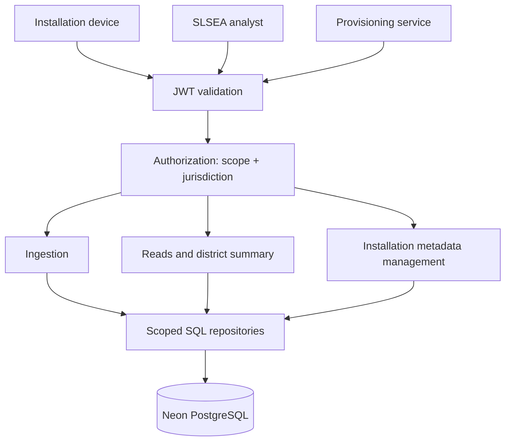

# 02 – Architecture

*PLAN.md §6*

One modular, stateless service on Vercel. Nothing is kept in memory or local files between requests. The database is never reached from a browser, and migrations and seeding never run during a request or at startup.

## Who calls what

## Layers

| Layer | Owns | Must not |
|---|---|---|
| Router (transport) | HTTP parsing, content negotiation, headers, status codes, JSON output | Run SQL or unrestricted queries |
| Authentication | Checking the JWT signature and claims; building the "principal" (who is calling) | Trust a token that was only decoded, not verified |
| Authorization | Principal type, scope, jurisdiction | Let a query parameter widen access |
| Service | Ingestion rules, overview assembly, summary maths, transactions | Depend on Express objects |
| Repository | Parameterised SQL with the scope filter always applied; count, order, paging | Guess authorization from raw client input |
| PostgreSQL | Foreign keys, unique and check constraints, atomic writes, indexes | Be reachable from browsers or Swagger |

In the code: `src/http/` (transport helpers, errors, ETags), `src/auth/` (JWT, principals, scope), `src/routes/`, `src/services/summary.ts`, `src/repositories/`, `src/db/`.

## What happens to each request

1. Assign a request id; apply the body size limit; match the route and method.
2. Authenticate (protected routes only).
3. Check content negotiation, the required scope, and route, query and body syntax.
4. Work out the caller's effective area from the verified token and the current database record.
5. Run the scoped lookup. An item outside the area looks exactly like one that does not exist.
6. Only now evaluate conditional headers (`If-None-Match`, `If-Match`).
7. Run the service or transaction; send the documented response and headers.
8. Log method, route template, status, duration and request id, never tokens or secrets.

**Fixed error precedence (as built):** 401 → 406 → 403 → 400 → 404. Authentication always comes first, so an anonymous caller learns nothing about which routes or items exist. Framework parse errors use the same error body as everything else.
