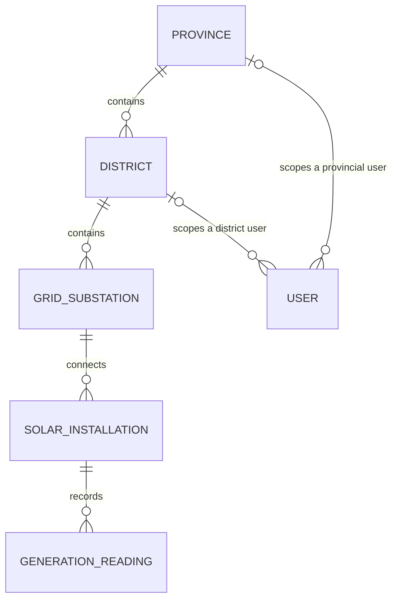

# 03 – Data model

*PLAN.md §7*

Exactly six entities: a five-level chain of places and assets, plus User. Each step down the chain is one-to-many.

A rendered version is in `report-figures/er-diagram.png`.

| Entity | Holds | Links |
|---|---|---|
| Province | id, code, name | has many districts |
| District | id, province, code, name | belongs to one province; has many substations |
| GridSubstation | id, district, code, name | belongs to one district; has many installations |
| SolarInstallation | id, substation, meter id, label, capacity kW, commissioning date, active, version | belongs to one substation; has many readings |
| GenerationReading | id, installation, timestamp, power kW, cumulative energy kWh, voltage V, received at | belongs to one installation |
| User | id, subject, display name, role, optional province or district, active | see below |

**User jurisdiction:** a national user has neither link; a provincial user has only `province_id`; a district user has only `district_id`. A district user's province is derived through District, never stored twice.

## The two rules everything else depends on

1. **The meter id is a column on the installation, not an entity.** A Device table would mirror Installation one-to-one with no lifecycle of its own (B §3 calls this a modelling flaw). Consequence: a device logs in *as its installation*, so a device token's subject is the installation id.
2. **Readings are append-only history.** Every reading is a new row, unique per installation and timestamp. Nothing updates or deletes one, so the "latest reading" is computed from history, not stored on the installation (B §3 calls last-value fields the most common mistake).

As built, append-only is enforced three times over: the API has no update or delete route (405), the runtime database login has no UPDATE, DELETE or TRUNCATE right on readings, and a trigger rejects changes even from the owner role.

## Storage choices

- UUID ids; seed ids are deterministic so reruns produce the same ids.
- `timestamptz` everywhere; JSON times are UTC strings ending in `Z`.
- Observation time (`timestamp`) is separate from arrival time (`received_at`). A late reading for an older time never becomes the "latest".
- `version` on installations supports safe concurrent edits.
- Unique codes, unique meter ids, and `UNIQUE (installation_id, timestamp)` for duplicates.
- Checks: power and energy not negative, capacity positive, voltage bounded (0-1000 V). Readings more than 5 minutes in the future are rejected; late readings are allowed.
- Foreign keys restrict deletion where history exists. Readings are never cascade-deleted.
- The API connects as the `solar_api` role (least privilege); migrations and seeding use the owner role.
- No public user or token endpoints: users and tokens are created by scripts.

## Indexes

| Index | Supports |
|---|---|
| `districts(province_id)` | Province navigation, jurisdiction joins |
| `grid_substations(district_id)` | District navigation, summary membership |
| `solar_installations(substation_id)` | Asset navigation, area filters |
| unique `solar_installations(meter_id)` | Meter identity |
| unique `generation_readings(installation_id, timestamp)` | Duplicate detection, per-site history, latest reading |
| `generation_readings(timestamp, installation_id, id)` | Cross-site time windows with stable ordering |

The plan says to check real query plans on seeded data before adding more, and not to claim performance from index names alone.
