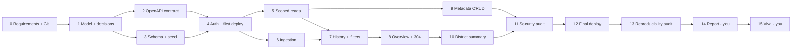

# 11 – Phases and checklists

*PLAN.md §19-23*

## Build order

| Phase | Work | Plan estimate | Exit gate | Status (2026-10-10) |
|---:|---|---:|---|---|
| 0 | Requirements, sources, versions, prompt log, Git | 3-4 h | Sources mapped | Done |
| 1 | Conceptual model, security boundaries, Q1/Q2 decisions | 4-6 h | Model explainable | Done |
| 2 | API catalogue, first OpenAPI | 4-6 h | Contract covers the rubric | Done (`b5d9b86`) |
| 3 | Schema, migrations, seed, verification | 6-9 h | 134,400+ readings, FK checks | Done (`4eb3164`) |
| 4 | JWT/policy skeleton + early Vercel/Neon deploy | 5-8 h | Protected DB request and docs live | Done |
| 5 | Scoped hierarchy reads | 4-6 h | T02 passes | Done |
| 6 | Ingestion, append-only guarantees | 4-6 h | T03 + duplicate race | Done (`b840708` + fix `9e8e3e9`) |
| 7 | History, regional queries, paging, filters | 5-7 h | T04/T05 | Done |
| 8 | Overview, latest, conditional GET | 5-7 h | T06/T07 | Done |
| 9 | Metadata CRUD + concurrency | 3-5 h | T08 | Done (`820d214`: 204 delete) |
| 10 | District summary | 5-8 h | T11 on a hand fixture | Done (`b2c19b6`…`1072a56`) |
| 11 | Security, error and contract audit | 5-8 h | T09/T10/T14 | Done (`e98014c`) |
| 12 | Final deployment, ops, performance | 4-6 h | T12/T13/T15 | Done (release `d0b7130`) |
| 13 | Reproducibility and submission audit | 3-5 h | Clean checkout, URLs, real prompt records | Done |
| 14 | **Your** report and AI appendix | 7-10 h | Word count, six sections, signed declaration | Yours |
| 15 | **Your** viva rehearsal | 3-6 h | You explain the code and demo area isolation | Yours |

Plan total: about 70-107 hours plus 15-20% contingency. Suggested pace: week 1 phases 0-6, week 2 phases 7-11, week 3 phases 12-15. If time runs short, cut optional extras before weakening security, data integrity, deployment or required coverage.

## Definition of done (every increment)

- The requirement and guideline references are known.
- The code is understandable and stays within the planned scope.
- Meaningful normal and negative tests pass.
- OpenAPI matches the running behaviour, including statuses and headers.
- Design changes are recorded (ARCHITECTURE.md) and progress is recorded (PROJECT.md).
- The real prompt and any repair are logged (AI_LOG.md), with honest critique.
- Evidence is sanitised and linked to a real commit.
- You can explain why it is correct and what its limits are.

Commit coherent pieces as you go. Never split one finished application into cosmetic commits at the end.

## Risk register

| Risk | Impact | Mitigation |
|---|---|---|
| CRUD contradicts append-only and read-only roles | Marks, security | Decide Q1 early; keep the write/read split regardless |
| Summary URI convention conflict | Design marks | Q2 decision with explicit rubric/G reasoning |
| Cross-area leaks via aggregates, cache or counts | High security impact | Scope in SQL; adversarial tests |
| Wrong energy calculation | Misleading analytics | Register differences, time-zone bounds, coverage counts, reset fixture |
| Old seed presented as live | Weak evidence | Show staleness; ingest fresh readings honestly |
| Tokens expire during marking | Examiner locked out | Private credentials plus a renewal process, checked before hand-in |
| Vercel function/static asset problems | Broken docs | Deploy early; commit `public/`; smoke after every release |
| Connection exhaustion; previews writing to production | Outage, data loss | Pooled bounded connections; previews have no database |
| Seed or migration inside a function times out | Partial database | Separate CLI jobs, batching, tracked migrations |
| Delete or re-parenting rewrites history | Data integrity | FK restrict; block history-bearing delete and re-parent |
| You cannot defend generated code | Viva forfeits marks | Review each increment; understand SQL, HTTP and auth |
| AI report text or invented prompt history | Integrity breach | Write the report yourself; keep the real AI log |
| Repository sharing left to the last minute | Eligibility failure | Add the module leader as collaborator early |

## Report outline (your writing, plan §22)

| Section | Words | Questions to answer in your own words |
|---|---:|---|
| Architecture and data model | 450 | Why six entities? Why append-only readings and a meter attribute? Why these layers and constraints? |
| API design justification | 650 | Why these resource types and URIs? How do methods, headers, statuses, filters and validators follow G? |
| Security justification | 450 | How are device and user roles separated? Where is the area applied? Leak tests? Scope vs attribute trade-off? |
| Deployment | 250 | How do Vercel and Neon work together? What proves the deployed revision, persistence and working Swagger? |
| Richardson maturity | 250 | Which real requests prove Level 2? Why are `next`/`previous` links not Level 3? |
| Critical evaluation | 450 | Which defects were found and repaired? What limits remain (freshness, energy estimate, scale, operations)? |
| **Total** | **2,500** | Allowed range 2,250-2,750 |

Outside the word count: declaration, AI appendix, diagrams, tables, code listings, references.

## Viva checklist (plan §23)

- [ ] Q1/Q2 outcomes explained
- [ ] Six entities, hierarchy, meter attribute, preserved history
- [ ] Hierarchy, overview, last-known reading and history routes work
- [ ] Device writes only its own readings; every analyst write fails
- [ ] CRUD and complete-PUT semantics demonstrated (on a disposable installation)
- [ ] Paging (`count`/`next`/`previous`), area and time filters, both sort orders
- [ ] 201 + `Location`, 304 empty body, 406 and 412 shown with real requests
- [ ] ETag / `Last-Modified` applicability and caveats explained
- [ ] District summary correct, scoped and honest about freshness
- [ ] Seed scale verified
- [ ] One JSON error schema everywhere
- [ ] Auth, SQL, count and cache leak tests pass
- [ ] Live API and Swagger over HTTPS with no provider login wall
- [ ] Data survives redeploy; previews cannot touch production
- [ ] Genuine incremental commits; **module leader added as collaborator**
- [ ] Report original, in range, all six sections; declaration signed; AI appendix complete
- [ ] Examiner token renewal arranged
- [ ] You can explain any code, SQL join, the summary formula and the JWT check

**Rehearsal script:** walk the hierarchy → ingest as device A → show device B and an analyst denied → read the new `Location` as an analyst in that area → compare ascending and descending history → show one district cannot see another → demonstrate 304 and 412 → explain the summary arithmetic → explain Level 2 and the remaining limits. Run `npm run simulate` first so the data is fresh.
